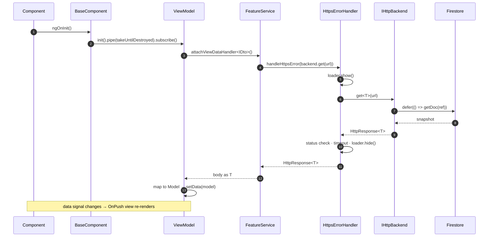
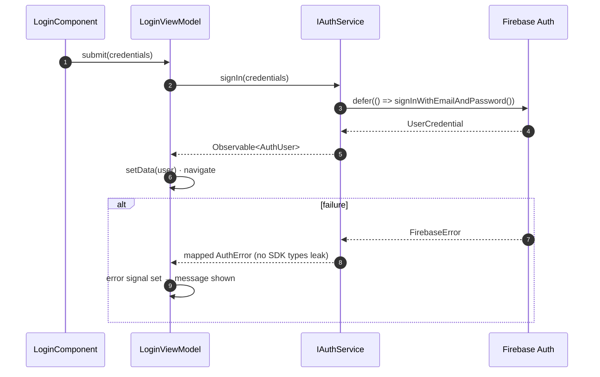
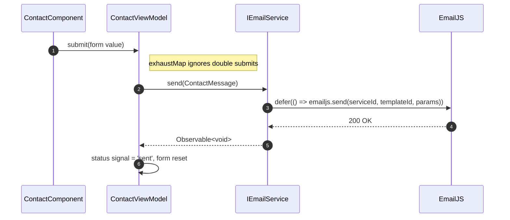
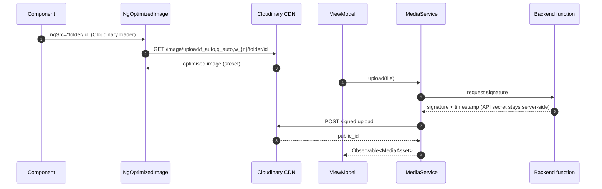

# Sequence Diagrams

## 1. Loading view data (every feature)

```mermaid
sequenceDiagram
  autonumber
  participant C as Component
  participant BC as BaseComponent
  participant VM as ViewModel
  participant S as FeatureService
  participant EH as HttpsErrorHandler
  participant P as IHttpBackend
  participant FB as Firestore

  C->>BC: ngOnInit()
  BC->>VM: init().pipe(takeUntilDestroyed).subscribe()
  VM->>S: attachViewDataHandler<IDto>()
  S->>EH: handleHttpsError(backend.get(url))
  EH->>EH: loader.show()
  EH->>P: get<T>(url)
  P->>FB: defer(() => getDoc(ref))
  FB-->>P: snapshot
  P-->>EH: HttpResponse<T>
  EH->>EH: status check · timeout · loader.hide()
  EH-->>S: HttpResponse<T>
  S-->>VM: body as T
  VM->>VM: map to Model → setData(model)
  Note over C,VM: data signal changes → OnPush view re-renders
```

## 2. Sign-in (Firebase Auth)

```mermaid
sequenceDiagram
  autonumber
  participant C as LoginComponent
  participant VM as LoginViewModel
  participant A as IAuthService
  participant FA as Firebase Auth

  C->>VM: submit(credentials)
  VM->>A: signIn(credentials)
  A->>FA: defer(() => signInWithEmailAndPassword())
  FA-->>A: UserCredential
  A-->>VM: Observable<AuthUser>
  VM->>VM: setData(user) · navigate
  alt failure
    FA-->>A: FirebaseError
    A-->>VM: mapped AuthError (no SDK types leak)
    VM->>VM: error signal set → message shown
  end
```

## 3. Contact form (EmailJS)

```mermaid
sequenceDiagram
  autonumber
  participant C as ContactComponent
  participant VM as ContactViewModel
  participant E as IEmailService
  participant EJ as EmailJS

  C->>VM: submit(form value)
  Note right of VM: exhaustMap ignores double submits
  VM->>E: send(ContactMessage)
  E->>EJ: defer(() => emailjs.send(serviceId, templateId, params))
  EJ-->>E: 200 OK
  E-->>VM: Observable<void>
  VM->>VM: status signal = 'sent', form reset
```

## 4. Media delivery and upload (Cloudinary)

```mermaid
sequenceDiagram
  autonumber
  participant C as Component
  participant IMG as NgOptimizedImage
  participant CDN as Cloudinary CDN
  participant VM as ViewModel
  participant M as IMediaService
  participant FN as Backend function

  C->>IMG: ngSrc="folder/id" (Cloudinary loader)
  IMG->>CDN: GET /image/upload/f_auto,q_auto,w_{n}/folder/id
  CDN-->>IMG: optimised image (srcset)

  VM->>M: upload(file)
  M->>FN: request signature
  FN-->>M: signature + timestamp (API secret stays server-side)
  M->>CDN: POST signed upload
  CDN-->>M: public_id
  M-->>VM: Observable<MediaAsset>
```
